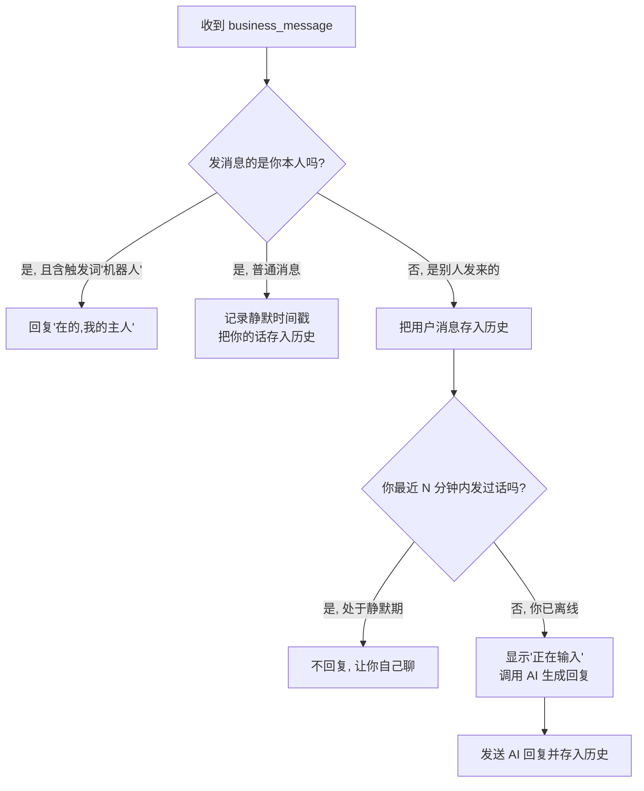

# AI 替身机器人 (AI Business Bot)

一个部署在 **Cloudflare Workers** 上的 Telegram「商务账号」AI 自动回复机器人。当你本人离线时，AI 会用「真人语气」冒充你自动回复找你的人；一旦你自己上线亲自回消息，AI 会立刻静默让位，避免和你抢话。

> 由 **培哥** 制作。

## 功能特性

- **离线自动接管**：你离线超过设定时间后，AI 自动代你回复。
- **在线智能让位**：你刚发过消息时进入「静默期」，AI 不插嘴。
- **上下文记忆**：基于 Cloudflare KV 保留最近 6 条对话，回复能接上下文。
- **正在输入状态**：回复前显示「对方正在输入…」，更像真人。
- **触发词唤醒**：你发送「机器人」，它会回复「在的，我的主人」用于确认在线。
- **调试日志**：运行日志实时发送到你自己的私聊，方便监控。
- **OpenAI 兼容接口**：支持 Mistral 或任何 `/v1/chat/completions` 兼容的 AI 服务。

## 工作流程



## 前置条件

- 一个 Telegram Bot（找 [@BotFather](https://t.me/BotFather) 创建，获取 Token）。
- **Telegram Premium 会员**（使用「商务账号 / Business Account」功能所必需）。
- 一个 AI 接口（Mistral 或任何 OpenAI 兼容接口）。
- 一个 Cloudflare 账号。

## 配置

编辑 `index.js` 顶部的 6 个常量：

| 常量 | 说明 |
|------|------|
| `TELEGRAM_BOT_TOKEN` | BotFather 给的 Bot Token |
| `MY_TELEGRAM_ID` | 你自己的数字 ID（用 [@userinfobot](https://t.me/userinfobot) 查询），用于区分「你本人」和「别人」 |
| `OFFLINE_TIMEOUT_MINUTES` | 你离线几分钟后 AI 开始接管，默认 1 |
| `MISTRAL_API_KEY` | AI 接口的 API Key |
| `MISTRAL_BASE_URL` | AI 接口地址，如 `https://api.mistral.ai/v1/chat/completions` |
| `MISTRAL_MODEL` | 使用的模型名 |

> **安全提示**：不要把真实 Token / API Key 提交到 Git 仓库。建议改用 Cloudflare 的环境变量 / Secrets 管理密钥。

## 部署步骤

1. 在 Cloudflare 新建一个 Worker，把 `index.js` 的内容粘贴进去。
2. 创建一个 **KV 命名空间**，绑定名必须为 `BOT_KV`（代码中写死，用于存储聊天记录和静默状态）。
3. 填好配置常量后部署，获取 Worker 网址。
4. 设置 Telegram Webhook（在浏览器打开，替换成你的值）：
   ```
   https://api.telegram.org/bot<你的Token>/setWebhook?url=<你的Worker网址>
   ```
5. 连接商务账号：Telegram 设置 → **Telegram Business** → **Chatbots** → 填入你的 Bot 用户名。

完成后，别人发到你私人账号的消息就会以 `business_message` 形式推给这个 Bot 处理。

## 真实使用表现

- **你离线时**：对方发消息 → 看到「正在输入…」→ 收到自然、带上下文的 AI 回复（头像和名字都是你，基本看不出是 AI）。
- **你在线亲自聊时**：AI 全程静默，不会抢答。
- **发送「机器人」**：AI 回复「在的，我的主人」，用于快速确认它在工作。

## 注意事项

- 系统提示词让 AI「假装是真实人类」，即在不告知对方的情况下用 AI 代替你聊天。请仅用于正当场景（如自己的自动客服 / 自动应答），不要用于欺骗或诈骗。
- 使用商务账号功能需要 Telegram Premium。

## 许可证

[MIT](LICENSE)
